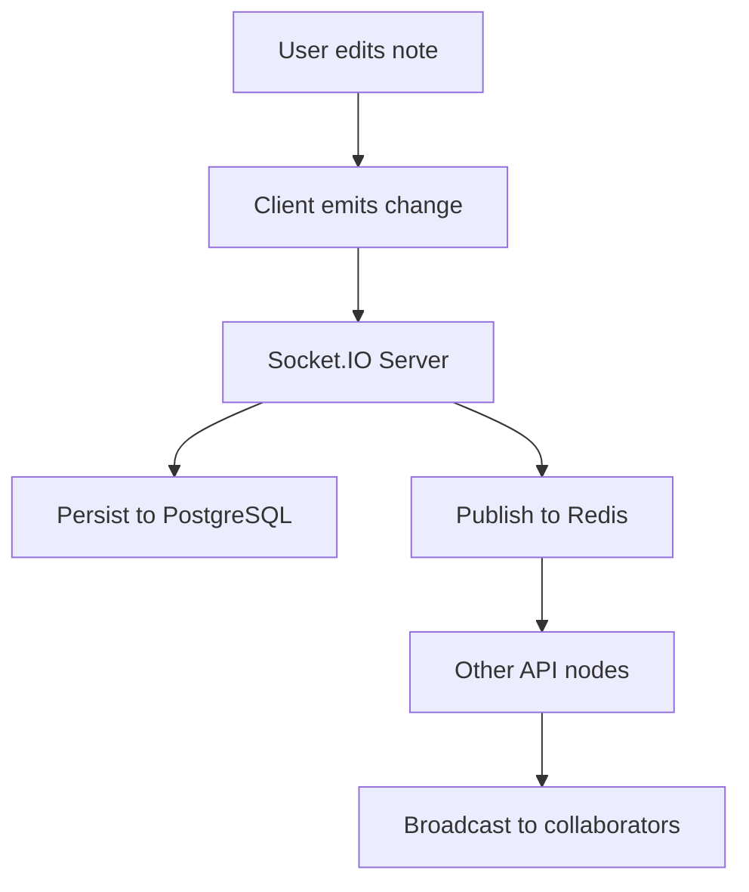
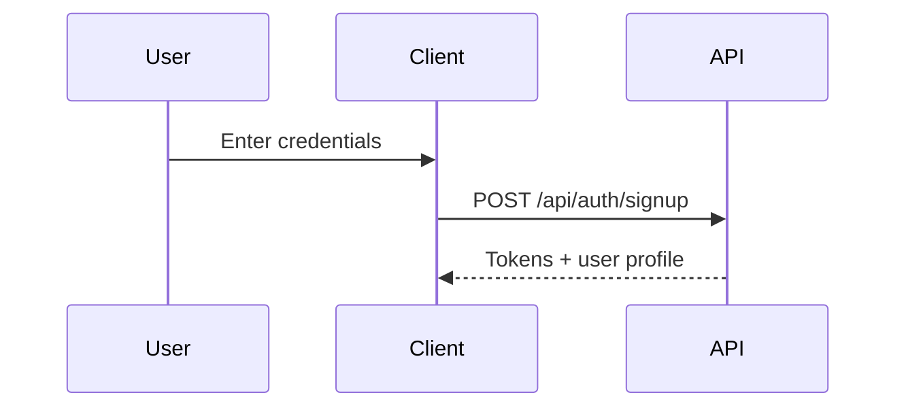
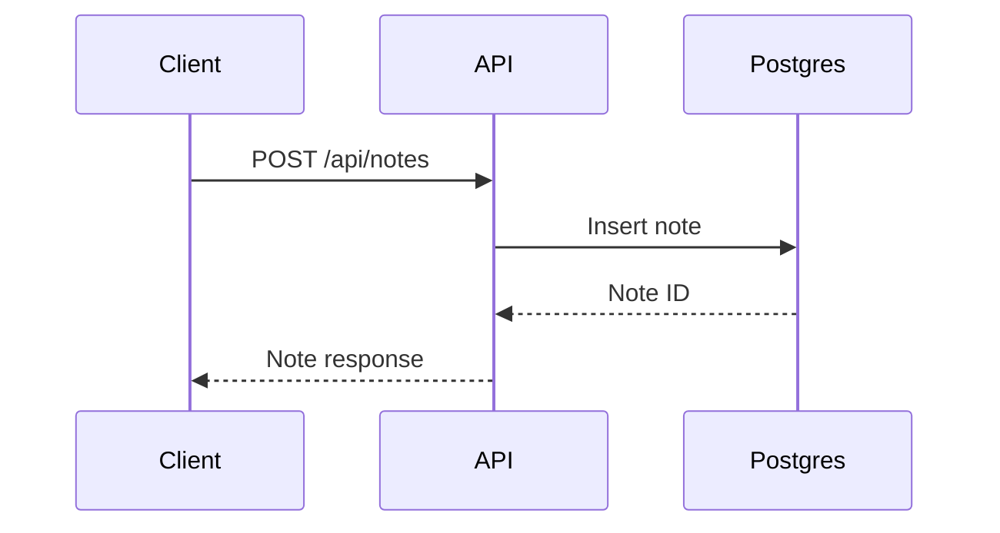
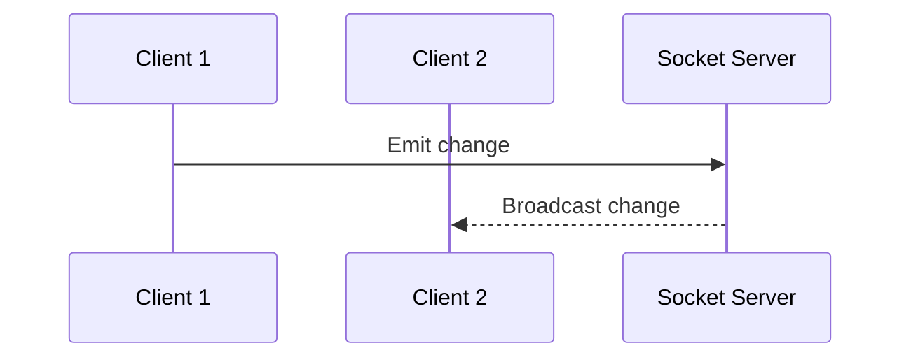
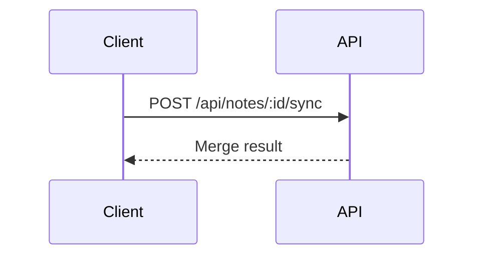

# Architecture

## Table of Contents

- [System Overview](#system-overview)
- [Component Breakdown](#component-breakdown)
- [Data Flow](#data-flow)
- [Sequence Diagrams](#sequence-diagrams)
- [Database Design](#database-design)
- [Scalability Considerations](#scalability-considerations)
- [Performance Characteristics](#performance-characteristics)

## System Overview

```
+------------------+     REST/WebSocket     +----------------------+
|  Web/Mobile UI   | <--------------------> |  API + Socket Server |
+--------+---------+                        +----------+-----------+
         |                                             |
         v                                             v
  +-------------+                              +-----------------+
  |  Auth + JWT |                              | PostgreSQL +    |
  |  Gateway    |                              | Redis Cache     |
  +-------------+                              +-----------------+
```

## Component Breakdown

### Frontend

- **React** for UI
- **Zustand** for state management
- **Socket.IO Client** for real-time updates
- **Offline store** for queued edits and sync

### Backend

- **Node.js + Express** REST API
- **Socket.IO** gateway for collaboration
- **PostgreSQL** for persistent data
- **Redis** for cache, sessions, and presence

### Database Schema

```
Users ──< Notes ──< NoteVersions
   └──< Collaborators >── Notes
Notes ──< NoteTags >── Tags
```

### Real-time Sync Architecture

- Clients join note rooms via Socket.IO
- Changes broadcast to all active collaborators
- Redis pub/sub synchronizes multi-node instances

### Authentication Flow

```
Client -> /auth/login -> JWT access token
Client -> Authenticated requests -> verify JWT
Client -> /auth/refresh -> new access token
```

## Data Flow



## Sequence Diagrams

### User Signup and Login



### Creating and Editing Notes



### Real-time Collaboration Flow



### Offline Sync Flow



## Database Design

### Tables and Relationships

- `users` — user profile data
- `notes` — note metadata and ownership
- `note_versions` — history and versioning
- `collaborators` — access control
- `tags` — tag dictionary
- `note_tags` — join table

### Indexing Strategy

- `notes(owner_id, updated_at)`
- `note_versions(note_id, version)`
- `tags(name)`

### Query Optimization

- Use pagination for list endpoints
- Preload tags via joins
- Cache frequently accessed notes

## Scalability Considerations

- Horizontal scaling with stateless API nodes
- Redis-backed Socket.IO adapter
- Read replicas for PostgreSQL

## Performance Characteristics

- Target API p95 latency: < 200ms
- WebSocket sync latency: < 150ms
- Support 5k concurrent users per region
