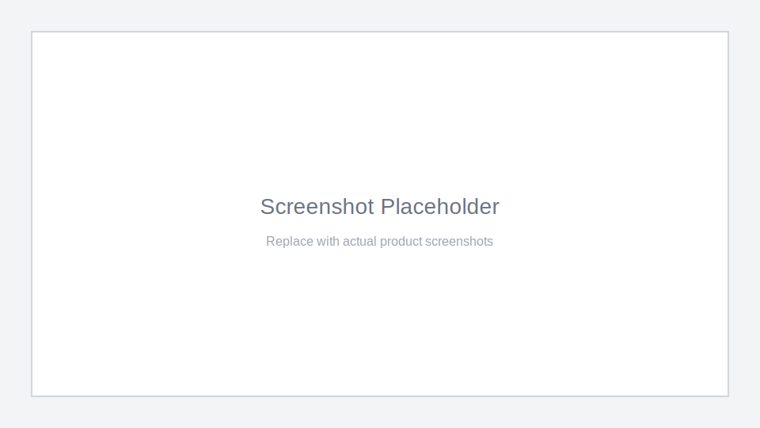

# SyncNote — Real-Time Collaborative Notes Platform

SyncNote is a collaborative note-taking platform designed for teams that need fast, reliable, and offline-capable writing. The vision is to provide a single source of truth for shared knowledge with real-time updates, secure authentication, and robust search.

## Table of Contents

- [Project Overview](#project-overview)
- [Key Features](#key-features)
- [Technology Stack](#technology-stack)
- [Quick Start](#quick-start)
- [Architecture Diagram](#architecture-diagram)
- [Screenshots / Demo](#screenshots--demo)
- [Documentation](#documentation)
- [Contributing](#contributing)
- [License](#license)

## Project Overview

SyncNote focuses on frictionless collaboration with a resilient data model. It supports real-time co-editing, offline-first workflows, and granular access control so teams can move quickly without compromising data integrity.

## Key Features

- **Real-time collaboration**: Live co-editing with presence indicators using Socket.IO.
- **Offline-first sync**: Queue edits locally and reconcile on reconnection.
- **Version history**: Full change tracking with rollback-ready snapshots.
- **Tags and search**: Structured tagging with full-text search.
- **Secure authentication**: JWT-based access and refresh tokens.
- **Scalable architecture**: Stateless API, Redis caching, PostgreSQL storage.

## Technology Stack

- **Frontend**: React, Zustand, Socket.IO Client
- **Backend**: Node.js, Express, Socket.IO
- **Data**: PostgreSQL, Redis
- **Observability**: Prometheus metrics, structured logging
- **Deployment**: Docker, AWS (EC2/RDS/ElastiCache), GitHub Actions

## Quick Start

1. **Clone and install dependencies**:
   ```bash
   git clone <repo-url>
   cd syncnote
   npm install
   cd client && npm install
   ```

2. **Configure environment variables**:
   ```bash
   cp .env.example .env
   ```

3. **Start local services**:
   ```bash
   docker-compose up -d postgres redis
   ```

4. **Run database migrations**:
   ```bash
   npm run db:migrate
   ```

5. **Start development servers**:
   ```bash
   npm run dev
   cd client && npm run dev
   ```

For detailed setup instructions, see [SETUP.md](./SETUP.md).

## Architecture Diagram

```
+-----------------+        WebSocket        +--------------------+
|  React Client   | <---------------------> |  Socket.IO Gateway |
+--------+--------+                          +---------+----------+
         | HTTP REST                                    |
         v                                              v
+-----------------+        SQL/Cache        +--------------------+
|  Express API    | <---------------------> | Postgres + Redis   |
+-----------------+                          +--------------------+
```

## Screenshots / Demo



> Demo video placeholder: add a link to a short walkthrough (e.g., YouTube or Loom).

## Documentation

- [SETUP.md](./SETUP.md) — Local development setup
- [API_DOCUMENTATION.md](./API_DOCUMENTATION.md) — Complete API reference
- [DEPLOYMENT.md](./DEPLOYMENT.md) — Production deployment guide
- [ARCHITECTURE.md](./ARCHITECTURE.md) — Detailed system design
- [TROUBLESHOOTING.md](./TROUBLESHOOTING.md) — Common issues & solutions
- [CONTRIBUTING.md](./CONTRIBUTING.md) — Developer guidelines
- [INFRASTRUCTURE.md](./INFRASTRUCTURE.md) — Ops & infrastructure
- [PERFORMANCE.md](./PERFORMANCE.md) — Performance guidelines
- [SECURITY.md](./SECURITY.md) — Security practices
- [CHANGELOG.md](./CHANGELOG.md) — Version history
- [GLOSSARY.md](./GLOSSARY.md) — Terminology

## Contributing

We welcome contributions! Please read [CONTRIBUTING.md](./CONTRIBUTING.md) to understand the workflow, code style, and testing requirements.

## License

This project is licensed under the MIT License. See [LICENSE](./LICENSE) for details.
